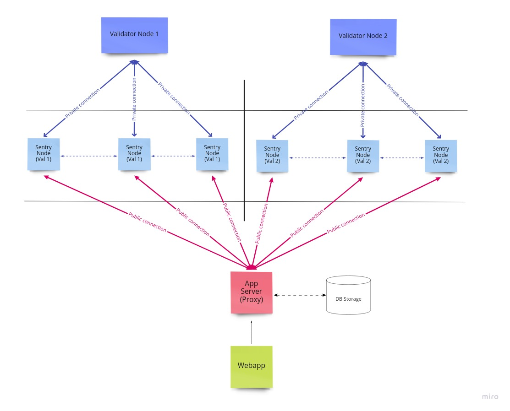

# Architectural evolution of Application Server

- Status: accepted
- Deciders: the dev team
- Date: 2021-12-15
- Tags: application server, infrastructure

## Context and Problem Statement

In order to fulfil Nolus's vision for a web3 application we need to establish a reliable way of communicating from a web app to the blockchain. This communication layer ideally should also be able to handle future requirements for custom queries/aggregations that could arise.

Most likely we will be working within the [standard network topology](https://docs.tendermint.com/master/nodes/validators.html) defined by Tendermint which means that we can rely on the set of full nodes (called Sentry Nodes in the topology terms).

We also have decided that we are going to use cosmjs to communicate with the blockchain from the web app, ergo we need at least cosmjs compatibility in our application server layer.

## Decision Outcome

Based on the requirements, we have decided to go with a hybrid approach. In order to fulfil the cosmjs compatibility, we are going to use a proxy mechanism (eg. dns record) which would transfer requests to the set of our validators sentry nodes. By using only our sentry nodes, we will guarantee that no one has tampered the blockchain data and a proxy such as dns record is an easy to implement resilient solution that will suffice our requirements. _This means that we will not be developing an explicit Application Server in our first phases of development._

In the future, if we need to aggregate data, we can extend this solution by:
 - creating data/event extractor and transformer from the Cosmos blockchain to a db storage
 - providing a standalone api server that exposes this data to the outside world via rest api

 

